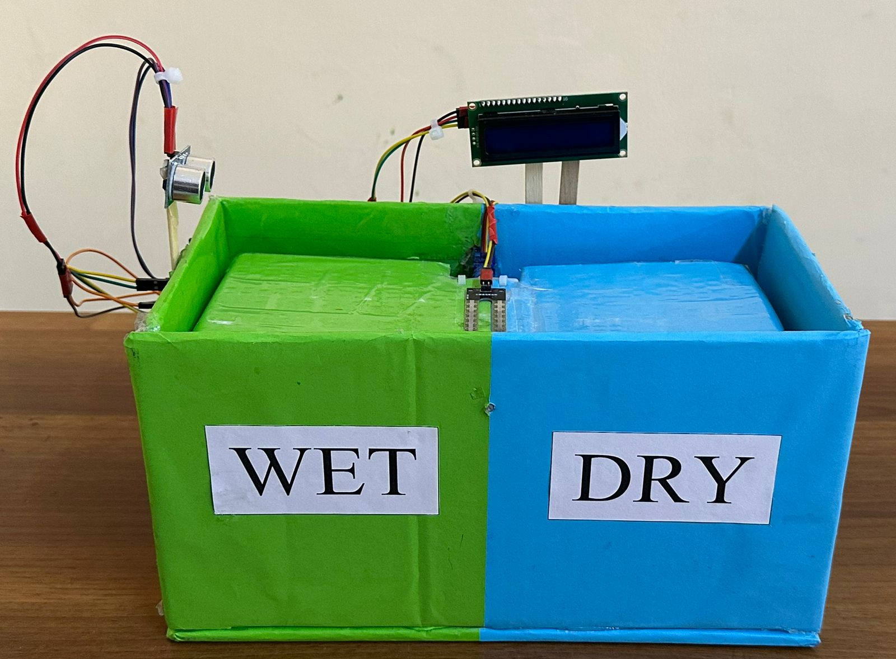
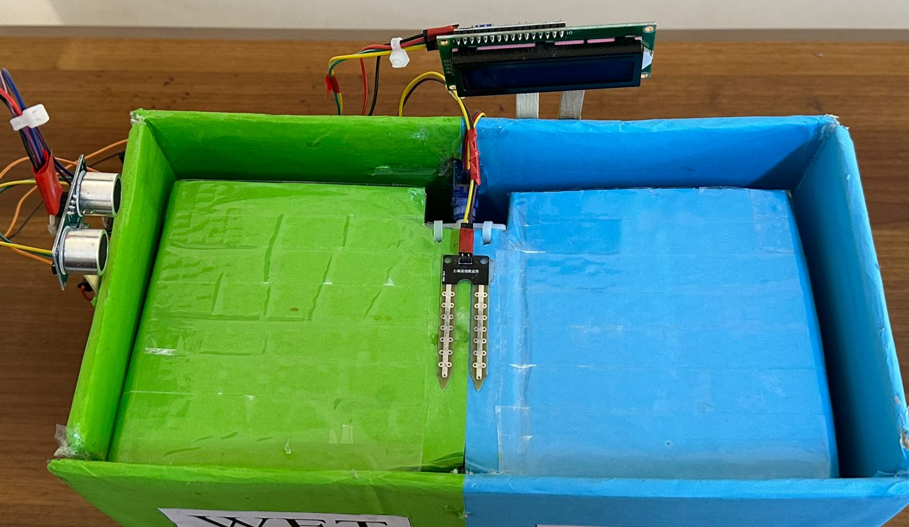
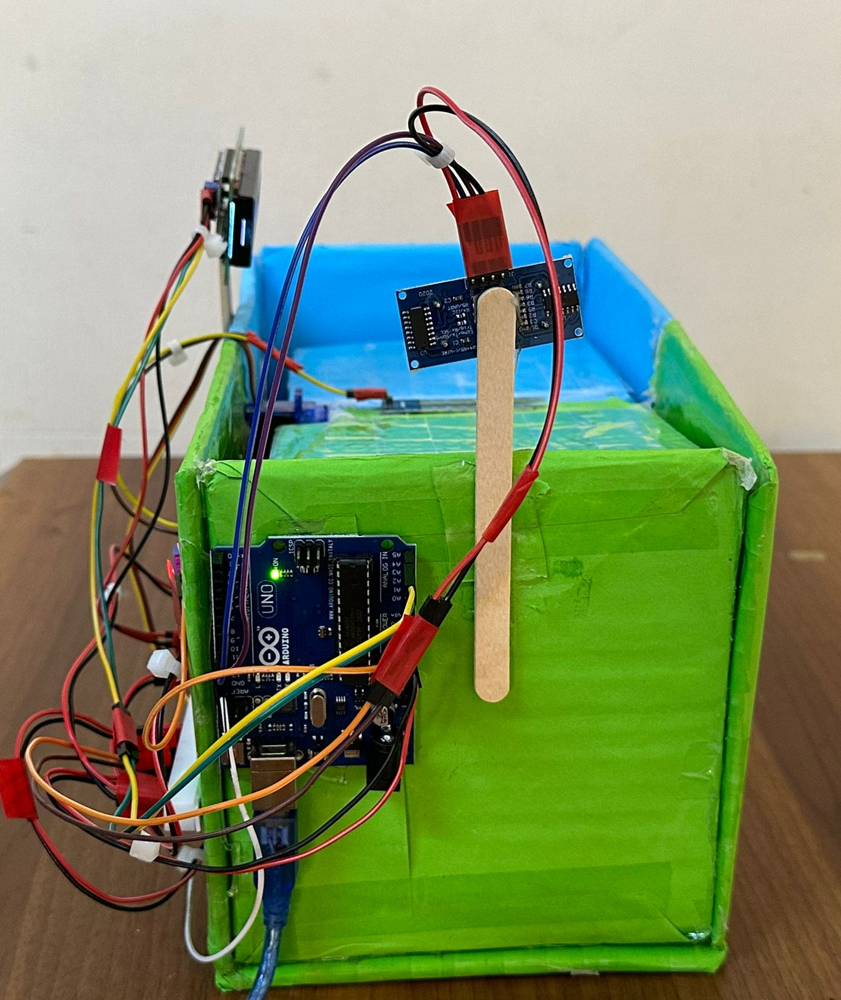
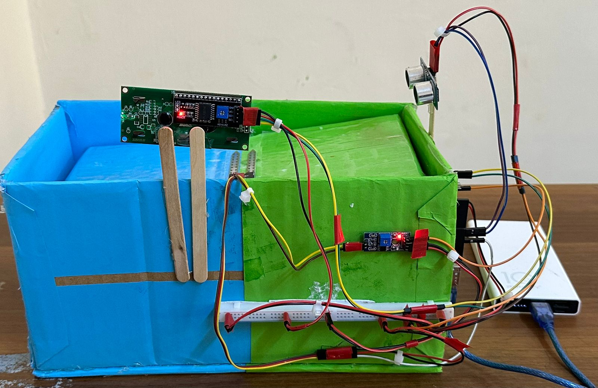
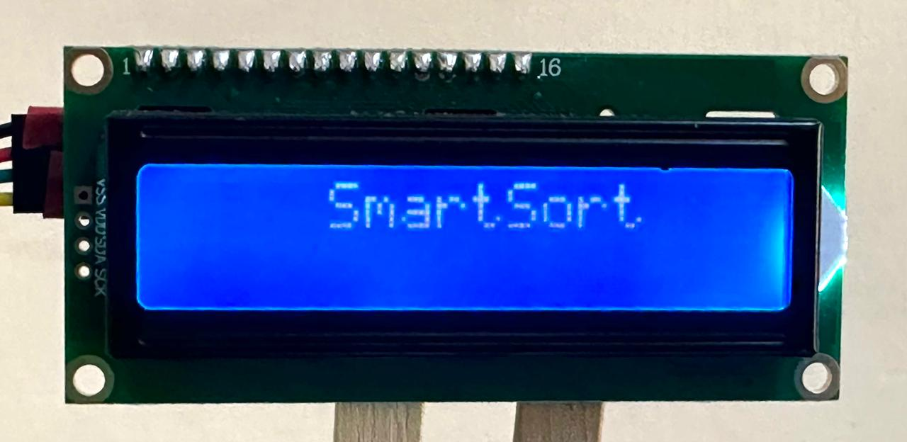
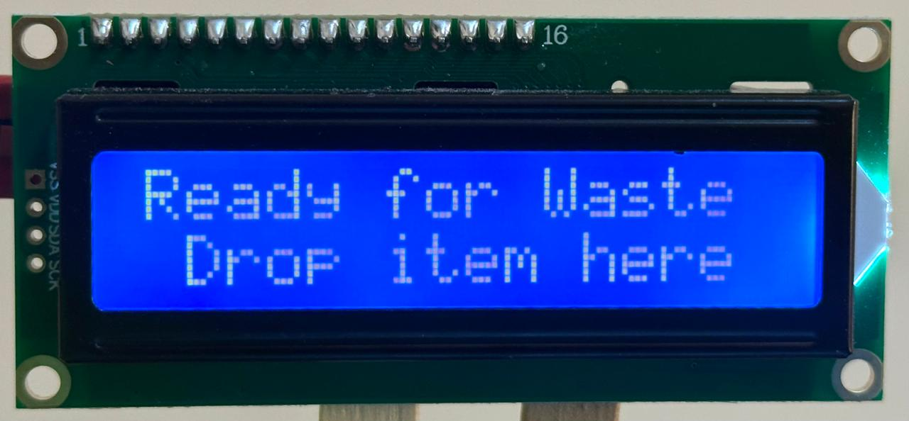
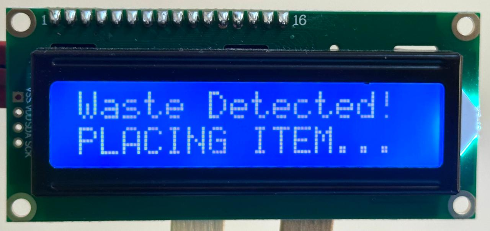
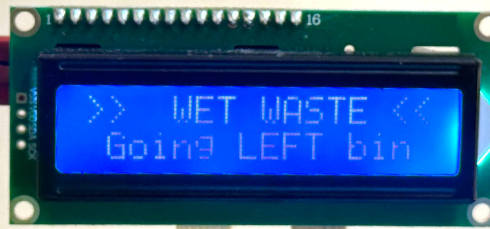
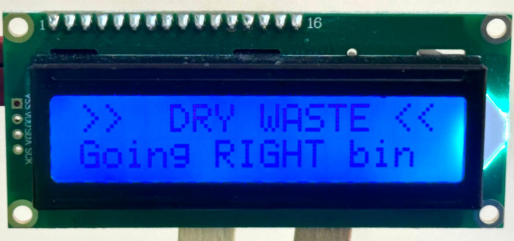
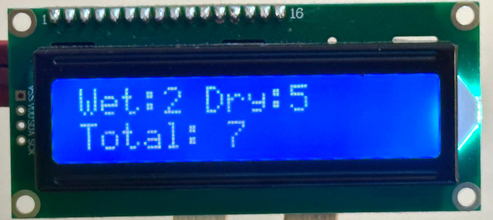

# SmartSort - Automated Waste Sorting System

SmartSort is an Arduino UNO-based edge device designed to perform real-time binary classification of waste at the moment of disposal. By automatically separating wet organic waste from dry recyclables, it prevents cross-contamination and preserves the recyclability of paper and cardboard materials.

---

## Overview

Relying on human compliance for waste segregation frequently leads to cross-contamination, as a single liquid item can ruin an entire bin of recyclable paper and cardboard. SmartSort provides an affordable, standalone embedded solution that eliminates human error by automating segregation right at the point of disposal.

Instead of requiring manual sorting, the system processes real-time sensor streams to classify waste into two actionable sorting streams:
* **Wet Waste Stream:** Directs organic materials, food waste, and liquids to a sealed compartment to prevent leakage.
* **Dry Waste Stream:** Isolates clean paper, cardboard, plastics, and metals to preserve their structural integrity for downstream recycling.

---

## Repository Code Structure

* **`SmartSort_Code.ino`**: The primary C++ firmware loaded onto the Arduino board that handles ultrasonic object detection, analog moisture sampling, dual-bin servo motor execution, and real-time counter updates.
* **`CircuitDiagram-MP.pdf`**: Schematic diagram illustrating component wiring, pin mappings, and power rail configurations.

---

## Tech Stack & Hardware

* **Microcontroller:** Arduino UNO R3 (ATmega328P)
* **Sensors & Actuators:**
  * **HC-SR04:** Ultrasonic Proximity Sensor (Distance-based trigger < 20 cm)
  * **YL-69:** Soil / Waste Moisture Sensor (Analog threshold classification)
  * **SG90:** Micro Servo Motor (160° Wet / 20° Dry / 90° Center)
* **Display:** 16x2 LCD Display with I2C Module (PCF8574)
* **Language / Framework:** C++ (Arduino Framework)

---

## Key Features & Performance

* **Edge Processing:** Executes all sensor calculations and motor actuation completely offline with zero cloud dependency or network latency.
* **Liquid Contamination Shield:** Automatically isolates organic/liquid waste at the point of disposal to protect clean paper, cardboard, and recyclable materials.
* **Low-Cost Architecture:** Built using accessible components to provide an affordable, deployable pre-sorting solution for public or office spaces.

---

## Circuit Connections

| Component | Component Pin | Arduino Pin |
| :--- | :--- | :--- |
| **HC-SR04 Ultrasonic** | Trig | Digital 9 |
| **HC-SR04 Ultrasonic** | Echo | Digital 8 |
| **YL-69 Moisture** | AO | Analog A0 |
| **SG90 Servo** | Signal (Orange) | Digital 12 |
| **I2C LCD** | SDA / SCL | A4 / A5 |

---

## Operating Logic

1. **Idle State:** System displays `Ready for Waste` on the I2C LCD screen.
2. **Proximity Trigger:** When an object comes within 20 cm, the system enters the placement phase.
3. **Sampling:** After a 5-second delay to position the item on the probe, the sensor samples moisture level on Pin A0.
4. **Classification & Sorting:**
   * **Moisture < 900:** Classified as **WET WASTE** $\rightarrow$ Servo swings to 160° (Left Bin).
   * **Moisture $\ge$ 900:** Classified as **DRY WASTE** $\rightarrow$ Servo swings to 20° (Right Bin).
5. **Reset:** The flap holds for 4 seconds, returns to the 90° center position, and updates the local item counter.

---

## System Hardware Views

| Front View | Top View |
| :---: | :---: |
|  |  |

| Side View | Back View |
| :---: | :---: |
|  |  |

---

## System Display Workflow

| 1. Startup | 2. Ready State | 3. Object Detected |
| :---: | :---: | :---: |
|  |  |  |

| 4. Wet Waste Decision | 5. Dry Waste Decision | 6. Counter Summary |
| :---: | :---: | :---: |
|  |  |  |

---

## License

This project is licensed under the **MIT License** - see the [LICENSE](LICENSE) file for details.
